**Full-Stack Developer · AI/ML Builder · Hackathon Winner**

 

## 👋 About Me

> I got into tech because I like making things people actually use — the code is just how I get there.

I'm a CS & Design student at **Dr. D. Y. Patil Vidyapeeth (DYPSST), Pune**, working toward becoming a full-stack developer who ships things that solve real problems. Most of what I know, I've picked up by doing rather than reading, and hackathons are where that shows the most — I've been to enough of them now that finishing as a finalist or winner happens more often than not. I don't have years of experience yet; what I have is a habit of not stopping until something works.

I also spend a lot of time outside my own projects. As **President of the Hackathon Club**, I spend as much time building teams as I do building software — and watching a team I put together win feels just as good as shipping code myself.

- 🎓 B.Tech, CS & Design @ DYPSST, Pune — **CGPA 9.8 / 10** (2023 – 2027)
- 🏆 Hackathon finalist or winner, more often than not — more in **Hackathon Highlights** below
- 🤝 Running a 500+ team hackathon and mentoring on pitching & strategy, alongside coursework
- ☕ Off the clock: making tea and queuing up a podcast

 

## 🛠️ Tech Stack

| Category            | Stack                                                                                                                                                                                                                                                                                                                                                                                                                            |
| ------------------- | -------------------------------------------------------------------------------------------------------------------------------------------------------------------------------------------------------------------------------------------------------------------------------------------------------------------------------------------------------------------------------------------------------------------------------- |
| **Languages**       |                                                                                                          |
| **Web Development** |     |
| **AI / ML**         |                                                                                   |
| **Cloud & Tools**   |                                                                                                                               |

 

## 🔭 Currently

- **Building:** deeper GenAI integrations into full-stack products — moving from "called an API" to "designed the pipeline"
- **Exploring:** system design for offline-first, low-connectivity architectures — the problem Aegis AI's PWA setup only started to solve
- **Organizing:** Hacksphere 2.0 and this year's Smart India Hackathon internal round, as President of the Hackathon Club
- **Open to:** teammates for my next hackathon, or a full-stack / AI internship where I can ship fast

 

## 🚀 Featured Projects

### 🛡️ [Aegis AI — Disaster Management & Resource Optimization](https://github.com/kale-omkar/Disaster-Resource-Optimizer-AI)

   

An AI-powered disaster response platform built to cut through chaos when it matters most.

- Achieved **~95% triage accuracy** and reduced coordination time by **~40%** through automated SMS report processing and intelligent case routing
- Built a full-stack resource optimization system for **10+ emergency stations**, using an **offline-first PWA architecture** to keep coordination running in low-connectivity areas

### 🎯 [SaralMatch — AI Job Recommendation Engine](https://github.com/kale-omkar/SaralMatch-AI-Powered-Job-Recommendation-Engine)

   

A full-stack recommendation engine that matches people to jobs on substance, not just keywords.

- Increased match relevance accuracy by **33%** using Transformer-based semantic matching across **120+ job attributes**
- Automated resume parsing with **Google GenAI**, cutting manual data entry by **100%** across 10+ industries

 

## 💼 Experience

**AI & Data Analytics Intern** · Edunet Foundation (AICTE & Shell) · _Jan – Feb 2025_

- Built a CNN-based computer vision model in Python to classify waste materials for Green Tech sorting initiatives — **92% precision**
- Engineered data pipelines processing **10,000+ images**, strengthening predictive modeling for production ML deployment

**Front-End Development Intern** · Edunet Foundation (AICTE) · _Jun – Jul 2024_

- Built responsive single-page applications with React.js and CSS3, cutting page load latency by **30%**
- Introduced reusable component architecture across the SDLC, cutting development time by **20%**

 

## 🏆 Hackathon Highlights

| Result                                    | Event                        | Detail                                                                                                  |
| ----------------------------------------- | ---------------------------- | ------------------------------------------------------------------------------------------------------- |
| 🥇 **National Winner** — ₹2,00,000 prize  | VOIS Marathon 2.0 · Oct 2025 | Top 3% of 1,000+ teams (with Team Legacy), hosted by VOIS, Vi & Edunet                                  |
| 🎓 **President**, Hackathon Club (DYPSST) | Sep 2025 – Present           | Ran Hacksphere 1.0 (500+ teams) and the SIH internal round (59+ teams); mentored on pitching & strategy |

 

## 📊 GitHub Stats

 

<picture>
  <source media="(prefers-color-scheme: dark)" srcset="https://github.com/kale-omkar/kale-omkar/blob/output/github-contribution-grid-snake-dark.svg" />
  <source media="(prefers-color-scheme: light)" srcset="https://github.com/kale-omkar/kale-omkar/blob/output/github-contribution-grid-snake.svg" />
  
</picture>

 

---

### 💬 Let's Talk

Open to full-stack / AI-ML internships, hackathon teammates, or just a conversation about what you're building.

Thanks for stopping by — now go build something. 🛠️

